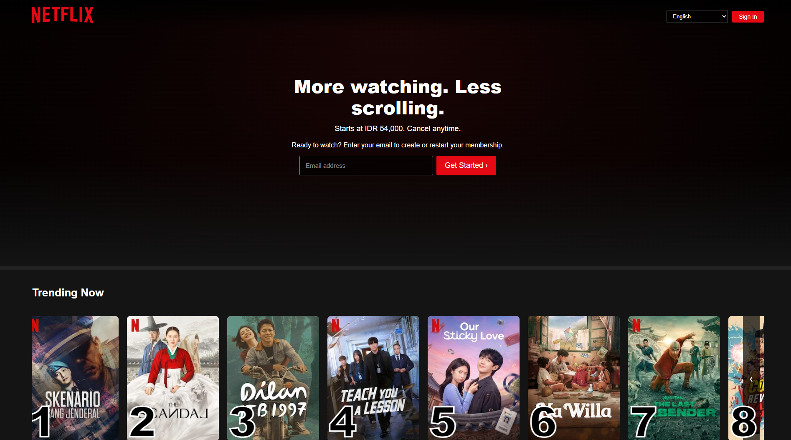
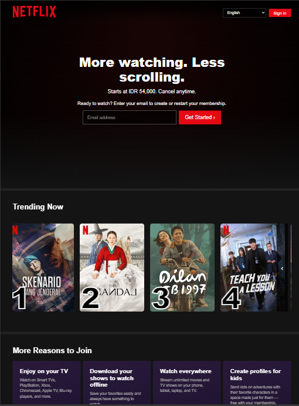
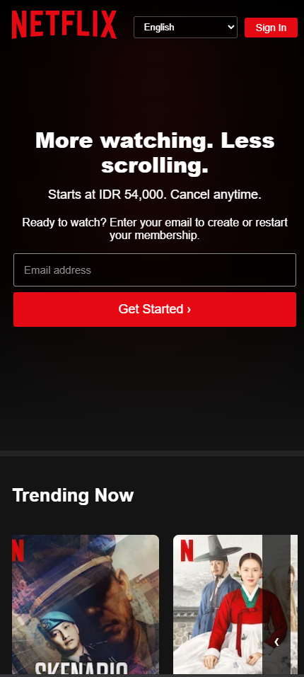

# Netflix Landing Page

A Netflix-inspired landing page built as a website slicing project using HTML, CSS, and JavaScript.

## Features

* Responsive layout for desktop, tablet, and mobile
* Netflix-inspired hero section
* Email input and validation
* Trending movies horizontal carousel
* Interactive carousel navigation
* FAQ accordion with open/close interaction
* Hover effects on movie cards and FAQ items
* Responsive navigation and content sections
* Mobile-friendly layout

## Tech Stack

* HTML
* CSS
* JavaScript (DOM)

## Implementation

### HTML

HTML is used to build the structure and content of the website. The page is divided into several sections, such as the hero section, trending movies, reasons to join, FAQ, and email form. Semantic elements such as `section`, `h2`, `p`, `form`, `input`, and `button` are used to organize the content.

### CSS

CSS is used to style the website and create a Netflix-inspired visual design. It is applied for layout, colors, typography, spacing, responsive design, hover effects, movie cards, carousel layout, and FAQ transitions.

CSS media queries are also used to adjust the layout and content for different screen sizes, including desktop, tablet, and mobile devices.

### JavaScript (DOM)

JavaScript is used to make the website interactive by manipulating HTML elements through the DOM (Document Object Model).

The JavaScript implementation includes:

* **FAQ Accordion** — uses DOM selection and class manipulation to open and close FAQ answers.
* **Trending Carousel** — uses `scrollBy()` to move the movie list horizontally and changes the arrow direction based on the scroll position.
* **Email Validation** — retrieves the email input value from the DOM and validates the email format before displaying a message.
* **Event Listeners** — uses `click` and `scroll` events to respond to user interactions.
* **Class Manipulation** — uses `classList` to add, remove, and toggle classes for interactive elements.

## Screenshots

### Desktop



### Tablet



### Mobile



## Project Structure

```text
netflix/
├── index.html
├── style.css
├── script.js
├── assetss/
│   ├── image/
│   └── icons/
```

## Deployment

This website is deployed using GitHub Pages.

## Disclaimer

This project is created for educational purposes and is not affiliated with or endorsed by Netflix.
